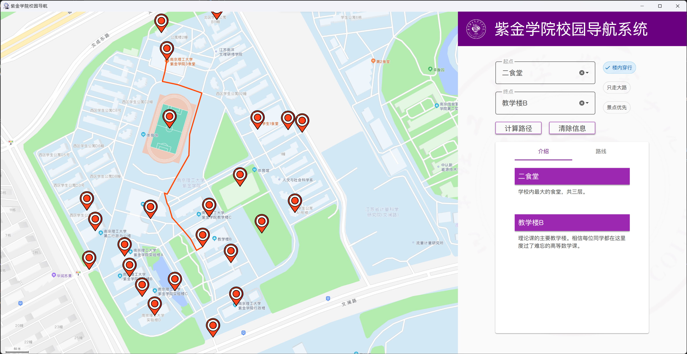
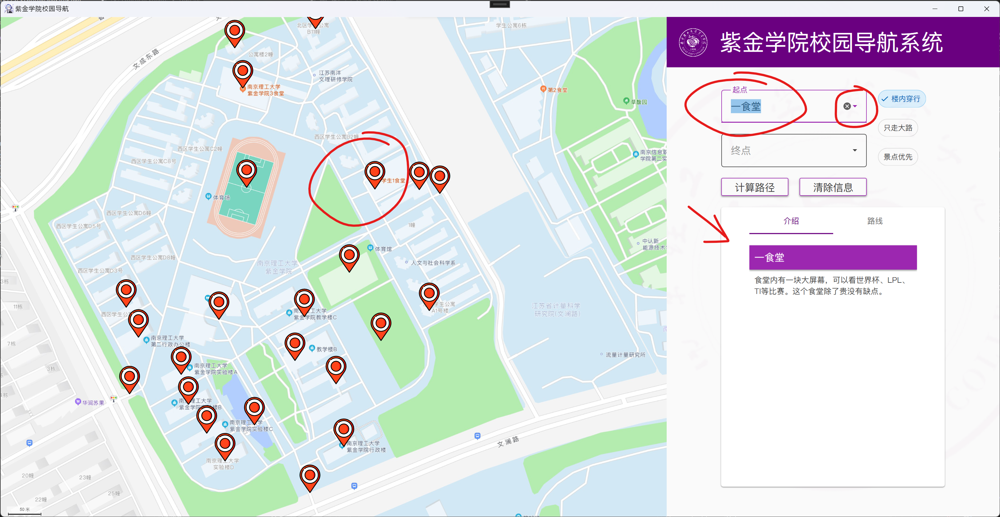
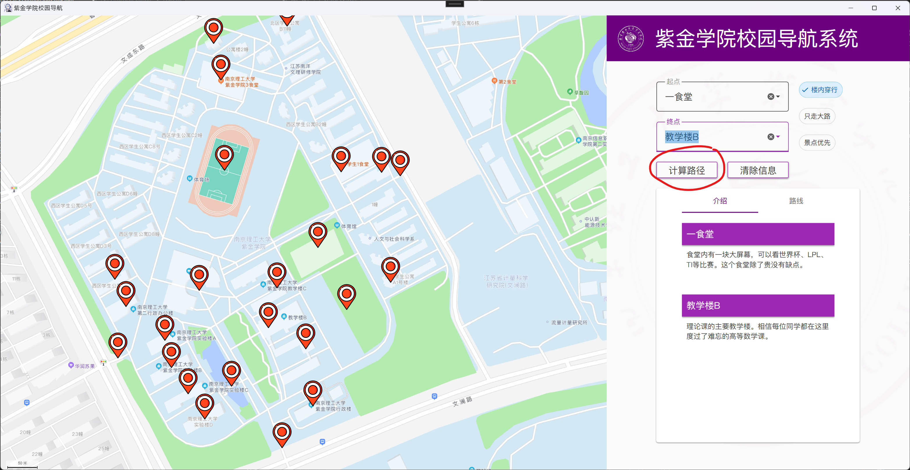
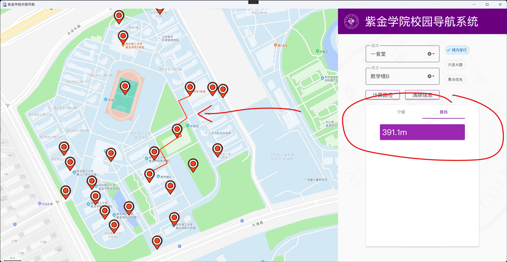
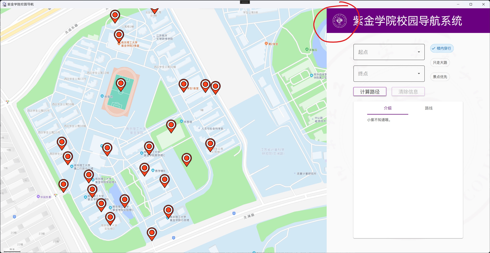
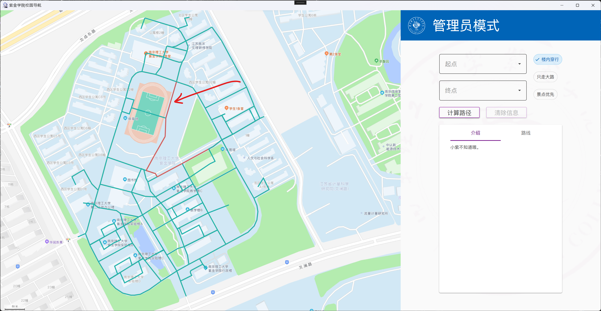
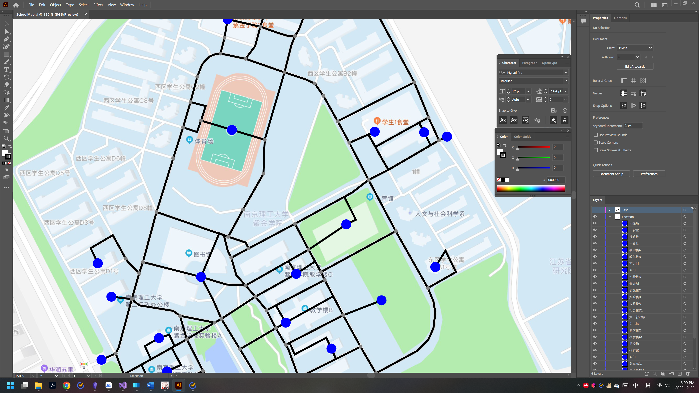
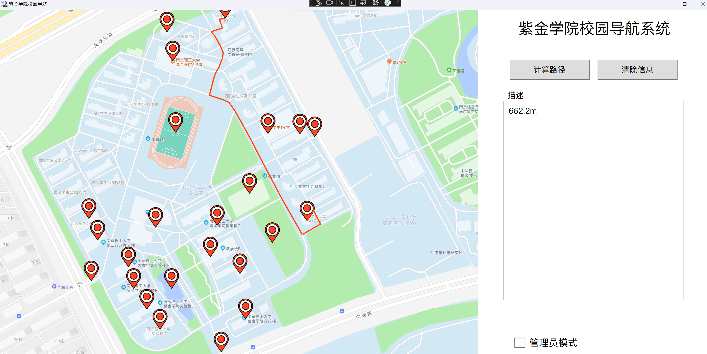
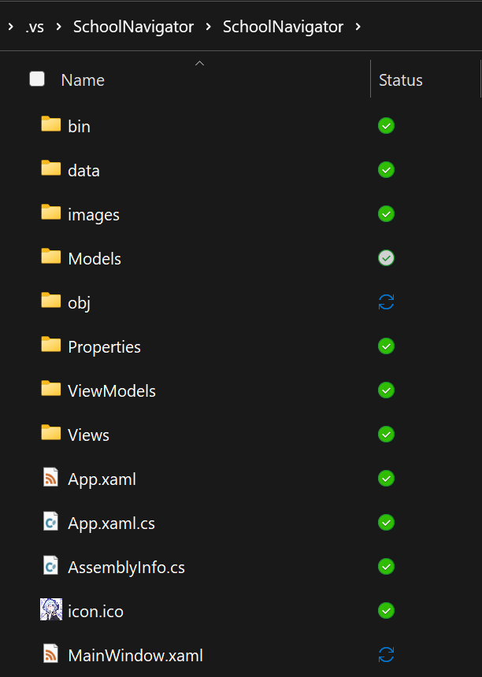

# 数据结构课程设计题目2——校园导航图的实现

## 一、设计内容与要求

1. 设计一个学校的校园平面图，所选结点不少于30个。以图中顶点表示校园各景点，存放景点名称、代号、简介等信息；以边表示路径，存放路径长度等相关信息。
2. 为来往客人提供图中任意景点相关信息的查询。
3. 为来往客人提供图中任意景点的问路查询，即任意2个景点间的最短路径，给出具体路径和路径长度。
4. 除了完成基本功能外，最好能提供实时实时路径查询，例如某条路径的临时关闭（需在程序中实现）后的最短路径的计算。
5. 提交设计报告，报告包括代码、设计思路（流程图）和实现界面截图等。

## 二、需求分析

在设计内容和要求中，重点是对两点之间最短路径的计算和显示。此外，为了更好的呈现校园导航的结果，我准备设计一个图形化的用户界面用于展示结果。

此外，需要提供一个“管理员模式”。当用户打开管理员模式后，有权限禁用一部分路径。

## 三、成品展示



### 1. 景点信息查询

可以通过三种方式选择景点。

- 点击地图上的红色标点；
- 在右侧“起点”或“终点”下拉框中选择；
- 在右侧“起点”或“终点”下拉框中输入景点名，景点名需存在。

选择完毕景点后，右侧“介绍”标签页内会显示**景点名**和景点的**描述信息**。



### 2. 景点之间最短路径查询

当您选择了两个景点分别作为起点和终点后，您可以点击“计算路径”按钮。



在这之后，程序会自动跳转到“路线”标签页，并显示两点之间的距离。



### 3. 管理员模式

鼠标右键点击标题栏**紫金学院Logo**将切换至管理员模式（再右键点一次会切回普通模式）。



进入管理员模式后，标题栏的颜色会改为醒目的蓝色，以作区分。


此时，将显示全部路线。以绿色标注的表示可用，以红色标注的表示禁用。

用鼠标点击一条路线后，会切换该路线的可用状态。



程序会对其状态进行实时保存。您不必担心意外关闭程序后修改会丢失。

## 四、快速上手

本项目使用 C# 语言编写主体程序，使用 Python 语言编写辅助脚本。

在您拿到源代码后，推荐使用 Visual Studio 2022 打开解决方案 `SchoolNavigator.sln`。

### 1. 安装 C# 环境依赖

> [!warning] 注意
> 
> 以下操作基于您已安装 `.NET Core SDK 6.0` ，以及在 Visual Studio 2022 中安装了 C# 相关的工作负载。
> 
> - 如需安装 .NET Core SDK 6.0，请前往[微软官方下载](https://dotnet.microsoft.com/zh-cn/download/dotnet/6.0);
> - 如果还没有安装C#工作负载，请使用 `Win + S` 在已安装应用内搜索 `Visual Studio Installer`，再在打开后的选择菜单中进行设置。详细步骤如有需要可以上网查询。

请在 Visual Studio 内置的 NuGet 包管理工具内安装以下依赖：

- `Newtonsoft.Json`
- `MaterialDesignThemes`

### 2. 安装 Python 环境依赖

> [!warning] 注意
> 
> 以下操作基于您已安装 `Python 3.6` 及以上的任意 Python 环境。
> 
> - 如需安装 Python，请前往官方网站下载，推荐安装最新版本的 Python。

请在支持 Python 的 IDE 或者编辑器，如 Visual Studio Code, PyCharm 或者另起一个 Visual Studio 窗口，打开项目所在文件夹 `SchoolNavigator`。

您应该能在文件夹内看到两个 Python 文件，分别是：

- `JsonDataScripts.py`
- `certificate_all_paths.py`

在当前文件夹中，新建 Python 虚拟环境：

```cmd
py -m venv venv
```

> [!important]- 本教程以 Windows 10/11 系统为例
> 
> 此处激活指令会随着您使用的**操作系统**或**控制台**类型而变化。如有安装失败的情况，请在确保您已正确安装 Python 的前提下，使用搜索引擎查找解决方案。

随后激活 Python 虚拟环境 venv：

```cmd
.\venv\Scripts\Activate.ps1
```

在虚拟环境 venv 中，安装以下 Python 包：

- `svgpathtools`

即，使用命令：

```cmd
pip install svgpathtools
```

### 3. 启动 Python 脚本生成数据

本项目中，C#代码需要一个位于 `.\data\graph.json` 的数据文件。这个文件由 `JsonDataScripts.py` 使用 `SchoolMap.svg` 生成。因此，先启动 Python 脚本生成数据：

```cmd
py JsonDataScripts.py
```

如果看到输出 `Success.` 即证明生成完毕。

此时，位于 `.\SchoolNavigator\data\` 目录下应该可以看到 `graph.json` 文件。

### 4. 启动 C# 程序

回到 Visual Studio 当中，在安装完毕依赖的前提下，按下 `F5` 或点击“SchoolNavigator"进行 Debug 模式启动。

弹出主窗口即为启动成功。请开始使用吧。

## 五、概要设计

概要设计涉及到前期的技术学习和测试。在最终确定下来的架构中，涵盖了如下几个核心技术点：

- 图形化界面
- 数据采集与数据处理（重点）
- 最短路径算法实现（重点）
- 在用户界面展示路线和节点信息
- 管理员模式

### 1. 图形化界面设计和实现

#### 技术选型

在项目初期，我计划使用 C++ 语言编写后端，并使用 Qt 框架制作图形界面。C++ 是我第一擅长的语言，但奈何经过我一番学习和评估，我发现 C++ Qt 这套开发模式并不能帮助我快速制作出美观简洁的界面。相反，使用 C++ 还会使得我花费更多的精力在一些晦涩的语法和不必要的底层实现上。

因此，最终我选择了 C# 语言进行开发，前端使用有比较成熟体系的 WPF 进行开发。

#### 界面设计

界面设计部分，首先是位于左侧的一张紫金学院大地图。右侧是主功能区，承担了选择景点、显示景点信息和显示景点之间距离的全部功能。


为了优化使用体验，我把在地图上显示的景点的标点也做成了可点击的。用户可以选择多种输入起点、终点的方式。

#### 景点信息动态展示

除此之外，我尽可能让用户体验和交互体验更加友好和直观。比如：

- 当选择起点、终点时，将自动展示景点详细信息；
- 当点击计算路径后，将自动跳转到“路线”标签页并显示两点间的距离。

### 2. 从地图获取信息：数据采集与数据处理

地图上的点不是凭空出现的。尤其是对于有图形化界面需求的导航系统，精确的描绘每一个节点所在位置十分必要。

#### 从画板导入节点和路径

第一步，先从高德地图、百度地图等软件拉取一张覆盖学校全域的大地图。先在 Adobe Illustrator 中将所有路线描下来，作为路径；同时也要描出每个路口，作为节点。

将画板中的内容以 `.svg` 格式导出后，使用算法提取路径和节点的关键信息。

#### 用脚本提取数据并转化成对象信息

在 Python 中编程，把 `.svg` 格式提供的路径信息：路径起点、终点、途径点；和节点信息：坐标x、坐标y，按照自己对库表的约定写入 `.json` 文件。

#### 在最终程序启动时读入所有数据

在程序初始化的时候，将 `.json` 文件中的所有数据读入并存储到内存中。

至此，对地图信息的采集和处理已经完成。我们已经得到了：

- 所有的节点：包括坐标x，坐标y；
- 所有的路径：包括起点、终点、途径路线、距离。

### 3. 最短路径算法实现：对 Dijkstra 算法的改进

#### 同时获取最短路径和途径节点

传统的 Dijkstra 的返回值有两种，要么返回最短路径，要么返回前驱节点。而我的程序当中因为需要在用户界面中显示出具体的路径，也就是说，路径是以一个对象的形式存储在内存中的。这就要求我的程序当中必须能够通过前驱节点找到路径。

#### 在程序中提前加载路线距离

根据上文所述，路线的坐标、距离信息是存储在本地的 `.json` 文件中，并在初始化加载时读入内存的。而 Dijkstra 算法需要的是一个以节点索引作为横、纵坐标的二维矩阵。一个坐标的值就是距离。

比如 `a[1][2]` 点的值代表从索引为 `1` 的点出发，到索引为 `2` 的点距离为 `a[1][2]` 。

如果这部分数据存在硬盘中，且不说前期需要通过 Python 脚本生成这些数据，从硬盘中读取数据的速度也远不如直接从内存中读取。故我在项目中采用的方案是在初始化读取数据文件后，在内存中生成这个矩阵。

### 4. 在用户界面展示路线和节点信息

此处重点在于让用户的体验更加自然和顺畅。并且在按下按钮之后也要有相应的事件给与相应。
我通过自行实现一些 `Handler` 方法和利用一些 `static` 变量，变相实现了一个观察者模式的委托系统。

有关详细信息展示和按钮、输入框等的前端设计都是一些常规知识，这里就不作展开了。

### 5. 管理员模式：禁用路线

在启用管理员模式后，获得禁用路线的额外功能。显然这里也是通过设置一个 `static` 变量作为flag来实现的。

同时，在退出管理员模式时，将会对设置的内容进行保存。

## 六、详细设计

详细设计中将对概要设计中提及的重点进行展开说明，关键部分会给出代码辅助解释。

### 1. 数据库表设计

- 路径 `Path`:

| 名称         | 字段             | 类型    | 主键？ | 可空？ |
| ------------ | ---------------- | --- | ------ | ------ |
| 索引         | `Id`             |   `int`  | 是     |        |
| 名称         | `Name`           |    `string` |        |   是     |
| 长度         | `Distance`       | `double`    |        |        |
| 起点ID       | `StartVerticeId` |  `int`   |        |        |
| 终点ID       | `EndVerticeId`   |  `int`   |        |        |
| 前端数据描述 | `Data`           |  `string`   |        | 是       |
| 是否启用     | `IsEnabled`      |   `bool`  |        |        |

- 节点 `Vertice`:

| 名称  | 字段 | 类型   | 主键？ | 可空？ |
| ----- | ---- | ------ | ------ | ------ |
| 索引  | `Id` | `int`    | 是     |        |
| 名称  | `Name` | `string` |        |        |
| 坐标x | `X`    | `double` |        |        |
| 坐标y | `Y`    | `double`       |        |        |

- 景点 `Location`: （继承自 `Vertice`）

| 名称  | 字段   | 类型     | 主键？ | 可空？ | 继承自父类？ |
| ----- | ------ | -------- | ------ | ------ | ------------ |
| 索引  | `Id`   | `int`    | 是     |        | 是           |
| 名称  | `Name` | `string` |        |        | 是           |
| 坐标x | `X`    | `double` |        |        | 是           |
| 坐标y | `Y`    | `double` |        |        | 是           |
| 描述  | `Info` | `string` |        | 是     |              |

### 2. 数据采集和数据处理

首先需要基于真实的学校地图得到路径和节点信息。

#### 使用 Adobe Illustrator 描出矢量图



在矢量图软件上画出所有的节点和路径。节点又分为普通节点和景点。以上三者分别位于三个图层上：

- `Locations` 景点；
- `Vertices` 节点；
- `Paths` 路径。

因为 Adobe Illustrator 在转化成 `.svg` 格式图像时会将描边定义为 `path` 曲线，所以用圆表示的景点和节点不能有描边，路径则不能有填充。

至此，三种元素的格式分别是（以图中的表示为例）：

| 类别 | 描边 | 描边颜色 | 描边厚度 | 填充 | 填充颜色 |
| ---- | ---- | -------- | -------- | ---- | -------- |
| 景点 | 无   | -        | -        | 有   | 蓝色     |
| 节点 | 无   | -        | -        | 有   | 灰色     |
| 路径 | 有   | 黑色     | 3px      | 无   | -         |

将画完的矢量图保存成 `.ai` 格式以备后续调整和修改，同时导出 `.svg` 格式用于转化。

在 `SchoolMap.svg` 文件中，对景点、节点、路径分别表示为如下形式（举例）：

```xml
<!-- 景点 -->
<g id="Location">
    <circle id="_宿舍楼3幢" data-name="宿舍楼3幢" class="cls-1" cx="421.5" cy="55.5" r="8"/>
</g>

<!-- 节点 -->
<g id="Vertice">
    <circle id="_0-6" data-name="0" class="cls-3" cx="532" cy="55" r="3"/>
</g>

<!-- 路径 -->
<g id="Path">
    <polyline class="cls-2" points="545 459 637.5 408.5 664 388"/>
    <line class="cls-2" x1="708" y1="471" x2="664" y2="388"/>
</g>
```

路径会根据是否为一条直线或折线段，分别表示为 `line` 和 `polyline` 。

在绘制路径的时候，不要使用贝塞尔曲线（在 Adobe Illustrator 软件中不要使用钢笔的锚点修改工具）。这是因为，

1. 当引入曲线时，路径的起点和重点难以确定，不利于后期导入程序时的转换和使用；
2. 对于贝塞尔曲线，计算它的长度属性的时间复杂度要远高于直线或折线段；
3. 在高德地图的背景图中，他们用的就是折线段而非贝塞尔曲线。

#### 在 Python 中转化 SVG 编码

首先新建一个字典用于存储转化的数据：

```python
graph = {
    "Vertices": [],  # 节点列表
    "Paths": [],     # 路径列表
    "Locations": []  # 景点列表
}
```

通过 `svgpathtools` 包的 `svg2paths` 函数，可以获取 SVG 文档中的所有路径信息和属性：

```python
paths, attributes = svg2paths("SchoolMap.svg")
```

`paths` 和 `attributes` 都是列表类型，按照 SVG 内元素从上到下的顺序依次罗列。

在进行转化操作之前，需要对 `paths` 和 `attributes` 进行分类。因为 `svg2paths` 函数会将所有的路径和节点保存在一起，我们需要根据它们不同的特点对它们进行逐一拆分：

```python
# 定义接收路径、节点、景点的列表
outputPaths = []
outputVertices = []
outputLocations = []

for i in range(len(paths)):
    if "r" not in attributes[i].keys():
        outputPaths.append(paths[i])  # 路径的特点：没有半径
    else:
        # 这个 class 是 SVG 的样式表，具体名字会根据你的实际情况而不同
        # 用样式的不同来区分节点和景点
        if attributes[i]["class"] == "cls-3": 
            outputVertices.append(attributes[i]) 
        else:
            outputLocations.append(attributes[i])
```

对于每一个节点 `Vertice` ，`attributes` 中包含了 `data-name`, `cx`, `cy` 属性。

```python
verticeCount = 0
for i in outputVertices:  # 这个 outputVertices 列表包含全部节点的 attributes
    graph["Vertices"].append({
        "Id": verticeCount,      # 给每个节点添加索引，从0开始
        "Name": i["data-name"],  # 节点名
        "X": float(i["cx"]),     # 节点坐标x
        "Y": float(i["cy"]),     # 节点坐标y
    })
    verticeCount += 1
```

我们以字典的形式存储这些特征。每一个节点在导入 C# 程序时，都会变成对应 `Vertice` 对象的字段。

---

对于路径 `Path` 而言也是同理：

```python
pathCount = 0
for i in outputPaths:   # 这个 outputPaths 列表包含全部路径的 paths
    graph["Paths"].append({
        "Id": pathCount,               # 给每个路径添加索引，从0开始
        "Name": f"Path_{pathCount}",   # 路径名，此处不做要求以备后续使用
        "Distance": i.length(),        # 路径的长度
        "StartVerticeId": -1,          # 路径起点（用节点的索引表示）
        "EndVerticeId": -1,            # 路径终点（同上）
        "Data": i.d(),                 # 路径的描述（用于前端显示）
        "IsEnabled": True,             # 路径是否启用（可在管理员模式将其禁用）
    })
    pathCount += 1
```

需要注意，对于路径来说需要的不是 `attributes` 属性，而是 `paths`。
因此 `svg2paths` 函数的返回值是一对元组，既有路径属性（对于点，则是用曲线的形式描述圆）和标签，分别能应对不同的使用场合。

此外，路径的起点和终点需要用特殊的函数计算出来，而这些只能在所有的节点（包括节点和景点）都录入进去以后才可以做到。因此此处先置为 `-1` 。后续可以用工具检查是否有遗漏的路径。

关于如何找到路径的起点和终点，实现起来较为简单。本文档中就不再赘述，感兴趣的读者可以前往给出的 `JsonDataScripts.py` 源代码进行阅读。

---

对于景点 `Location` 来说较为特殊，因为景点有“描述”（ `Info` ）这一字段，而 SVG 文件中不可能包含这种信息。所以，只能等到录入 Python 后用 Python 进行添加。而想要在 Python 中添加则需要首先获取索引或者名称，因此在景点的录入过程中，需要反复启动 Python 脚本两次：

```python
for i in outputLocations:
    graph["Locations"].append({
        "Id": verticeCount,
        "Name": i["data-name"],  
        "X": float(i["cx"]),  
        "Y": float(i["cy"]),       # 以上都和 Vertice 一致
        "LocatedVerticeIds": [],   # 这两个列表被弃用
        "LocatedPathIds": [],
        "Info": "" if ADDINFO else locationInfo[i["data-name"]],  # 重点
    })
    verticeCount += 1   # 与 Vertice 节点一起连续编号
```

注意这句重点：

```python
"Info": "" if ADDINFO else locationInfo[i["data-name"]]
```

`ADDINFO` 是一个布尔值，默认为 `False`。`locationInfo` 中对每一个景点都存放了对应的描述信息。
可以用景点的名称 `Name` 查找对应的描述信息 `Info`。

```python
locationInfo = {
    "大操场": "...",
    "二食堂": "...",  # 仅举例，具体可以在源代码中查看
}
```

在第一次启动脚本之前，需要先生成 `locationInfo` 中的 `keys`。
将 `ADDINFO` 改为 `True` 后，程序不再向 `graph.json` 中写入数据，而是输出一个包含所有 `Location` 景点名称的列表。您可以直接将其复制粘贴到 Python 代码中 `locationInfo` 的大括号内。

```python
DEBUG = not ADDINFO
if DEBUG:
	# 输出到 graph.json ...
else:
    for location in graph["Locations"]:
        print(f',"{location["Name"]}": \t\t\t""')  # 依次打印景点名称
```

在编辑好所有景点描述信息 `Info` 后，将 `ADDINFO` 重新置为 `False` ，程序即可开始向 `graph.json` 写入数据。

#### 在 C# 程序中读取数据文件

在完成数据处理之后，数据的导入工作就显得异常简单。简单到仅仅一行代码就做完了所有工作：

```cs
public partial class MainWindow : Window 
{
    private Graph? _graph;
    // ...
        
    public MainWindow() 
    {
        // 从文件读取数据
        var jsonString = File.ReadAllText(@"./data/graph.json");

        // 转化为对象
        _graph = JsonConvert.DeserializeObject<Graph>(jsonString);

        // 初始化 Dijkstra 矩阵
        _graph.InitializePathWeights();
    }
}
```

至此，所有的数据采集和数据处理工作已完成。

### 2. 优化并修改传统的 Dijkstra 算法

实现最短路径的计算，大致有三种算法可以采用，分别是：

- DFS 深度优先搜索；
- Dijkstra；
- A*

其中，Dijkstra 算法从一个起点开始会计算其它所有点的最短路径信息。因此，当起点不改变只改变终点时，Dijkstra 算法不需要消耗任何额外的计算。

这也使得 Dijkstra 的综合时间复杂度是这三者之中最短的。在使用优先队列（二叉堆）优化了算法内部的数据结构后，Dijkstra 对单个终点的最短路径查找时间复杂度为 $O(N \log N)$ ，对于所有起点和终点的查找时间复杂度再乘以 $N$ 就行。

#### 实现 Dijkstra 算法

Dijkstra 算法的返回值有两种，其一是出发点到各点的最短路径，返回一个数组。数组的每一个元素代表着从出发点到索引为数组下标的节点所需距离。如：我们选定索引 `0` 所在点为起点，那么 `distance[1]` 代表从索引为 `0` 的起点出发，到索引为 `1` 的终点，距离为 `distance[1]` 。由此，Dijkstra 算法也称为单源最短路径算法。

Dijkstra 算法的另一种返回值是每一个终点的前驱节点。换句话说，当我们计算出起点到所有终点的最短路径后，对于每一个终点，它在路径上的上一个点总是确定的，在经过路径从起点走向终点的时候，在到达终点前的上一个节点，被称为前驱节点。Dijkstra 算法可以返回对于每一个终点的前驱节点，并以数组的形式保存起来。

#### 同时返回最短路径和前驱节点

在一般的命令行程序里，求最短路径只需要一个最终的结果就行。但如果需要在图形化的界面上显示路线，每一个路线都是一个在内存中存在的对象。既然要把这个对象显示到屏幕上，那么显然我也就必须要拿到经过的所有节点，进而找到所有的路线。

```cs
public Tuple<double[], int[]> Dijkstra(int startIndex);
```

在对 Dijkstra 算法的定义中，本程序的返回值是一个 `(distance, prePoint)` 元组。分别存储距离和前驱节点。（注意，距离一定要是 `double` 型的）。

同时，这个方法是带状态的。两点之间距离的矩阵在程序初始化阶段就存储于 `Graph` 对象中。

```cs
public class Graph
{
    public double[][] PathWeights;
}
```

此时只需要获取一个起点，就能算出所有终点的位置。

而后再根据终点倒推所有路线即可。

### 3. 系统测试

本程序的用户交互测试需要您根据上文中“成品展示”部分的操作进行依次尝试。

数据集部分，可以使用任何学校/地点的路线作为数据。但需要您自行画图并提供地图的路线和节点信息。在您准备好这部分 `.svg` 的地图数据后，可以按照“快速上手”部分的指示进行操作，并把 `.\images\SchoolMap.jpg` 替换成对应的地图（分辨率需为 1200x900）。

## 七、自我总结

本项目核心功能底层实现耗时约3天，前端用户界面设计和完善耗时2天，而后续的持续改进和优化持续了约一周时间。不管怎么说，这都是我在这一年间做的最复杂且最有挑战的项目之一。

### 1. 在实现过程中遇到的问题

#### UI方面

首先是可视化的问题。在初期设计用户界面的时候我尝试自己通过 WPF 手写实现一个 UI。后来发现这样实现的 UI 不好看而且很难设计，达不到一个比较高的完成度。



当后续用 Material Design Themes 重构的时候，基本的界面布局已经来不及做比较大的调整。同时UI的底层代码比较混乱，耦合程度很高。

#### XAML转化脚本

承接上文UI部分，本来界面的UI是完全依靠 C# 的 XAML 代码实现的。比如对于每一个节点或者路径，就是5行 XAML 代码。可想而知，对于几百个节点和路径，这就是上千行代码。我当时的想法就是通过 Python 脚本生成这些前端代码，这种方式虽然确实可以出结果，但是绝对不是正确的编程习惯。

事实上，每一个 XAML 元素背后都是一个 C# 的对象，我完全可以直接在 C# 中对它们进行编程从而实现这些功能。这样我就可以充分利用编程语言所拥有的优势，比如 `for` 循环，对数据的直接读取等等。

最终这即帮助我优化了代码的可读性，还帮我去除了多余的数据库表字段，实现了精简化。

### 2. 可以新增和优化的功能

#### 增加路径计算的偏好功能

在设计完毕测试的过程当中，我发现有的时候虽然计算出来的绝对路径是最短的，但它并不总是一个最好的结果。比如有的时候从起点到终点，需要穿过好几栋建筑的内部，而这些建筑的内部结构是否清晰，是否允许通行，是否开放，都是个未知数。因此，我提供了“楼内穿行”选项，当选中时才会提供允许进入建筑内部的路线。

同样的，还有“只走大路”，适合汽车和大型团队使用；以及“景点优先”，适合校外访客和领导视察使用。

这些功能都属于基于核心功能的拓展。不需要改变原有的数据库字段，只需要在进入调用的方法时添加一些判断即可。但受限于时间，最终没能来得及实现。待日后有空闲时间了我会将这份代码完善一下并开源发布到网络。

#### 导航路线途径景点显示

细心的读者可以看到，“路线”标签页只显示了一个距离信息，下面没有任何东西，显得空空的。


事实上，这并不是设计失误。在那个显示总距离的文本框下方，原计划以列表的形式展示路线途径的所有重要景点。包括景点的名称、描述信息、距离上一个景点的距离（相对距离）、方位（东南西北等）。

这个在后端实现起来也不复杂。首先，景点的名称、描述信息等都可以直接从数据库提取，而距离上一个景点的距离，只要拿到两点之间全部路径的对象，就可以访问它们的 `Data` 字段并将它们加起来，就可以得到一个相对的距离。
而若想测得方位，可以把起点和终点视为平面直角坐标系上的两个坐标，起点到终点是一个向量。计算这个向量和坐标轴的夹角就可以得出方位了（运用 `Math` 库计算余弦值 `cos`，并用反余弦函数 `arccos` 反推角度）。

同样的，这个需求因为时间不够未能实现，最终不得不将其搁置。

### 3. 一些遗憾：因为技术原因未能实现的想法

#### 使用 MVVM 设计模式



在我的文件结构当中，有一个空的 `ViewModels` 文件夹。显然这是给 MVVM 设计模式准备的。但是因为我对 C# 和 MVVM Toolkit 不够熟悉，这块也未能实现。

（好在，在数据结构课程设计的另一道题目中，就已经能够使用基础的 MVVM 思想做页面导航了）。

#### 系统的使用 WPF

本项目的前端设计可以用灾难来形容。虽然最终成品的完成度和质感还算合格，但代码风格和项目管理则是制作现场的灾难。这种完全靠个人临时硬撑加班做出来的产品绝对不值得推崇。因此，对于我来说，学习一些基础的前端技术和 C# 设计模式迫在眉睫。

### 4. 课程总结

在本次的课程设计当中，我使用约一周时间完成了项目的开发，又用了一周多的时间进行了总结和梳理，随后才有了这篇课程设计文档。这是对我而言有着重大意义的一次实践经历，让我在软件开发方面立住了自信，同时让我更加熟练的梳理和掌握了数据结构一学期下来的各项知识。站稳了第一步，这才让我看清我日后的道路是多么的漫长。好在那并不是遥不可及的目标。希望在之后的学习和各种实战作业中能够有更好的发挥。

## 八、开源引用

开源引用部分包含本次项目使用的开发环境、开源框架、开源库等。
由衷感谢各位开源作者和软件对本人开发和学习的支持。

### 开发环境、IDE

- C# 开发环境，“宇宙第一”IDE：Visual Studio Community 2022
- Python 开发环境：Visual Studio Code
- Visual Studio 插件：JetBrains ReSharper
- 笔记、文档软件：Obsidian
- 矢量作图软件：Adobe Illustrator 2022
- 前端原型设计软件：MasterGo
- 思维导图、流程图设计软件：ProcessOn

### 开源框架、库、插件

- 基于 Google Material Design 的 C# WPF 前端框架：[MaterialDesignInXamlTookit](https://github.com/MaterialDesignInXAML/MaterialDesignInXamlToolkit)；
- 为数十亿 C# 和 .NET 程序提供 `.json` 格式文件支持的插件：[Newtonsoft.Json](https://www.nuget.org/packages/Newtonsoft.Json/)；
- 基于 Python `numpy` 库实现的 `.svg` 提取工具：[svgpathtools](https://github.com/mathandy/svgpathtools)。

### 辅助工具

- 在线 `.jpg` 转 `.ico` 网站：[convertico](https://convertio.co/jpg-ico/) 。

## 九、参考

以下用户和网站文档资源在本次项目当中帮助我解决了核心问题。在此表示不胜感激，也希望对正在看文档的你有所帮助。

- [下拉菜单文本改变时触发事件](https://stackoverflow.com/questions/6914942/how-do-i-get-textchanged-events-from-an-editable-combobox)
- [在 C# 程序中给 `Button` 添加 `Click` 事件](https://stackoverflow.com/questions/728432/how-to-programmatically-click-a-button-in-wpf)
- [C# `Expander` 结合 `ItemsControl` 批量添加列表](https://stackoverflow.com/questions/35794528/wpf-expander-in-items-control-with-user-control-fit-available-space)
- [使用 `ObservableCollection<T>` 进行动态绑定](https://cloud.tencent.com/developer/article/1828783)
- [WPF 动态绑定](https://blog.csdn.net/niuge8905/article/details/78760872)

以及，如教科书般的 [Microsoft Learn](https://learn.microsoft.com/zh-cn/dotnet/csharp/) 文档。

## 十、ToDo-List

记录目前遇到的所有bug和feature改进：

- [ ] 点击清除信息后，路线的长度不会清除；
- [x] 鼠标悬停在按钮上时，显示文本错误（显示了Material Design的默认提示文本）；
- [ ] 将MessageBox换成MaterialDesign 风格的 Dialog
- [ ] 管理员模式下，点击禁用（红色）的路线换回的颜色错误，为浅绿色（应为蓝绿色）
- [ ] 将下拉菜单改为 AutoSuggestBox（可选）
- [ ] 添加“路线”下的具体路线显示